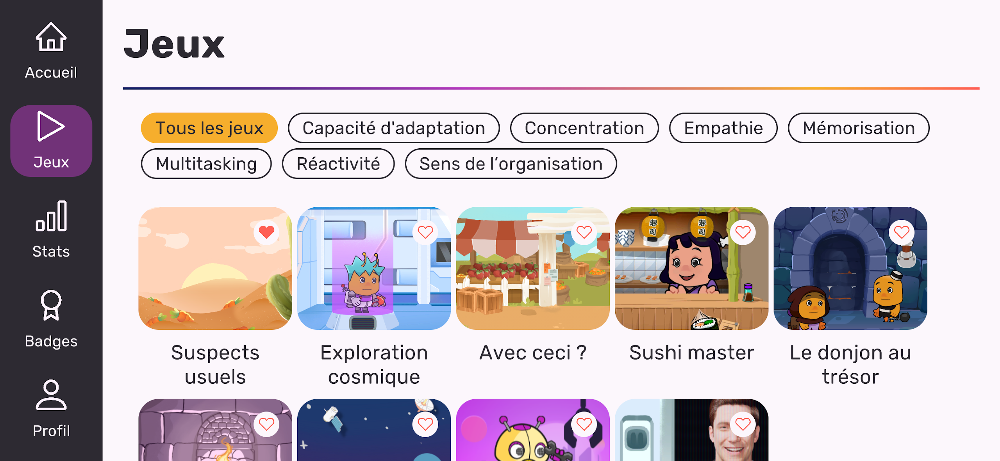
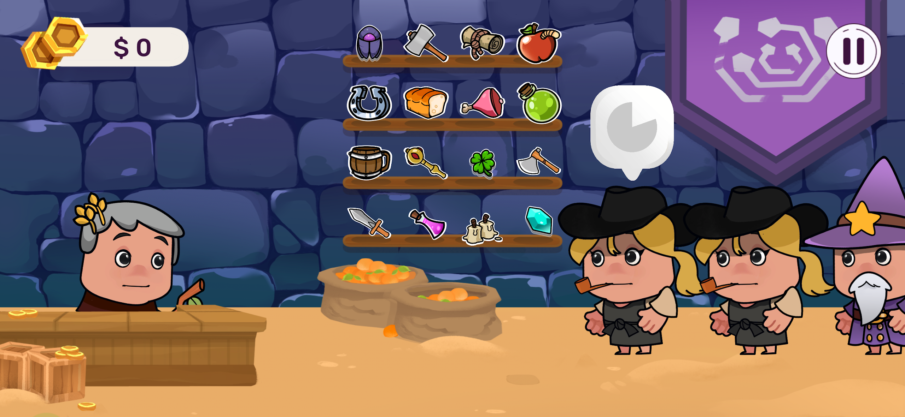
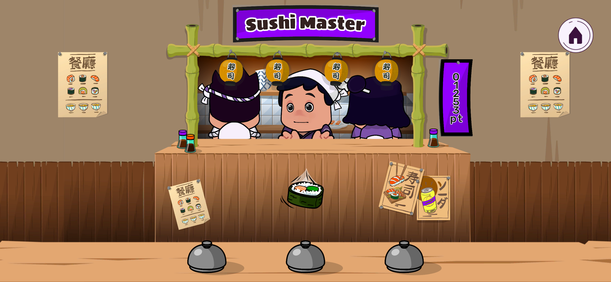

```{css style settings, echo = FALSE}
blockquote {
    padding: 10px 20px;
    margin: 0 0 20px;
    font-size: 10px;
    border-left: 5px solid #eee;
}
```

# Mon Portfolio

Bienvenue sur mon portfolio ! Ici, vous trouverez une courte présentation ainsi qu'une sélection de mes projets.

---

## 👋 Introduction

🎮 Je suis **Corentin Couasnon**, développeur spécialisé dans le jeu vidéo, je suis à la recherche d'un poste où je peux continuer à créer des expériences engageantes. J'ai principalement travaillé avec Unity en C#, mais j'aime explorer de nouveaux moteurs de jeu et diversifier mes compétences..

✨ Ce que j'aime particulièrement, c'est améliorer l'**expérience utilisateur** et intégrer des systèmes de jeu complexes. Participer à toutes les étapes d'un projet, de l'idée à la sortie, est ce qui me motive au quotidien.

👾 En tant que joueur régulier, j'ai une bonne compréhension de ce qui rend un jeu **captivant**, et j'adore travailler avec des équipes pour créer des jeux qui marquent les esprits.

---

## 🚀 Projets

### 1. Kirae
- **Description :** Kirae est une application mobile ayant pour but de développer et certifier les compétences de ses utilisateurs. L'application regroupe une dizaine de mini-jeux permettant d'entraîner une compétence clé chacun.
- **Technologies utilisées :** Unity, C#
- **Lien :** [Kirae sur le Google Play Store](https://play.google.com/store/search?q=kirae&c=apps&hl=fr)

[](./images/kirae/1.webp)
[](./images/kirae/2.webp)
[](./images/kirae/3.webp)

### 2. Gaming Campus
- **Description :** Plus d'une dizaine de jeux réalisés au Gaming campus, d'une durée moyenne d'une semaine et la plupart en groupe de deux ou trois personnes. Chaque projet était porté sur un aspect du développement de jeux vidéo, multijoueur, IA, algorithmes complexes...
- **Technologies utilisées :** Unity, C#

[](https://via.placeholder.com/1024)
[](https://via.placeholder.com/1024)
[](https://via.placeholder.com/1024)

### 3. Roblox - Block Miner Tycoon
- **Description :** Détruisez des blocs, récupérez des ressources, améliorez vos équipements !
- **Technologies utilisées :** Roblox Studio, Lua
- **Lien :** **_Jeu en cours de développement_**

[](https://via.placeholder.com/1024)
[](https://via.placeholder.com/1024)
[](https://via.placeholder.com/1024)

> _Découvrez plus de projets parmi des sites webs, un Tic Tac Toe en Lua, un bot Discord et plus encore sur mon [GitHub](https://github.com/CorentinCouasnon) !_

---

## 📄 Télécharger mon CV

Vous pouvez télécharger mon CV en cliquant sur le lien ci-dessous :

[**Télécharger mon CV**](./files/CV Corentin Couasnon.pdf)

---

## 🌐 Me contacter

- **GitHub :** [CorentinCouasnon](https://github.com/CorentinCouasnon)
- **LinkedIn :** [Corentin Couasnon](https://www.linkedin.com/in/corentin-couasnon/)
- **Email :** ccouasno@gmail.com
- **Téléphone :** 07 50 39 71 43