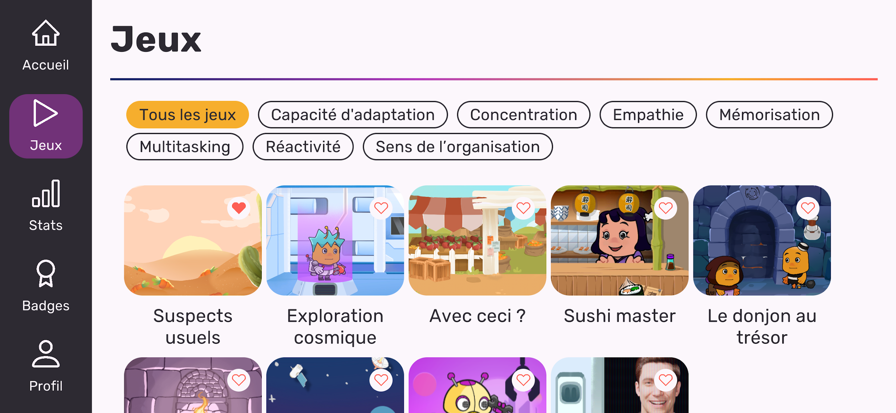
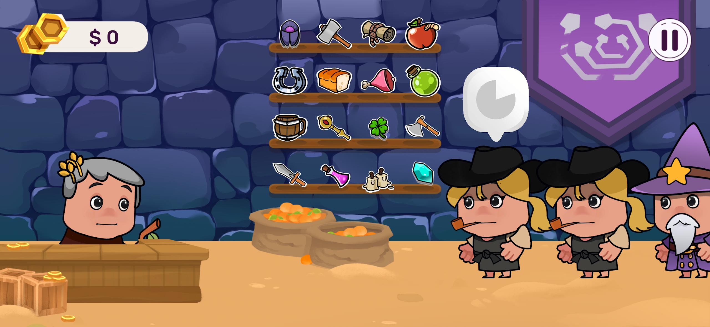
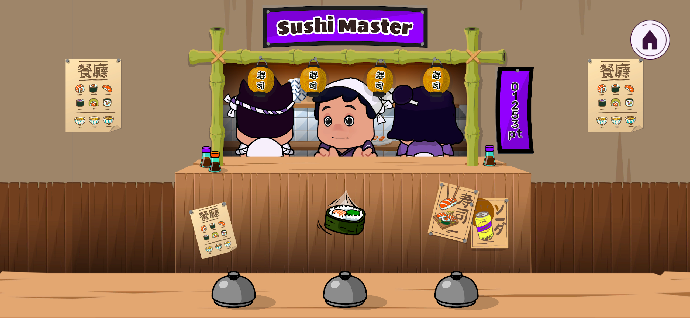
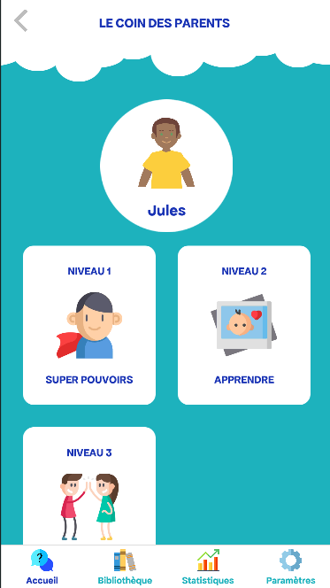
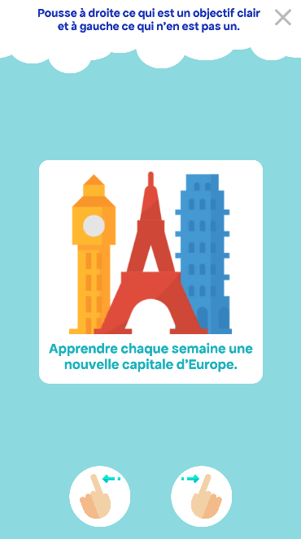
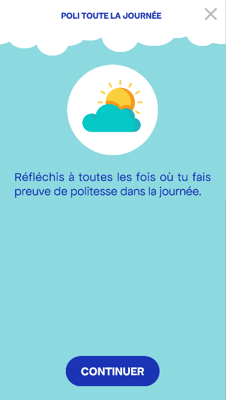
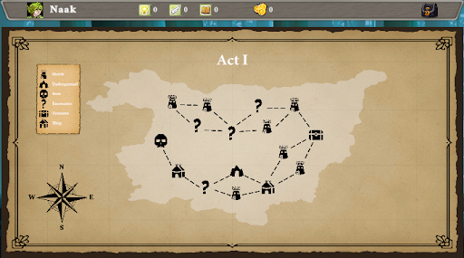
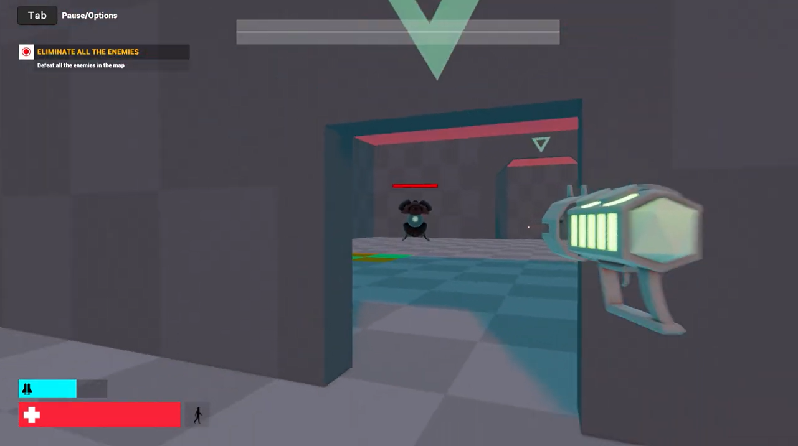
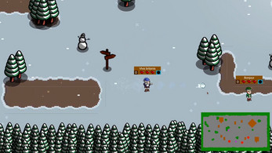
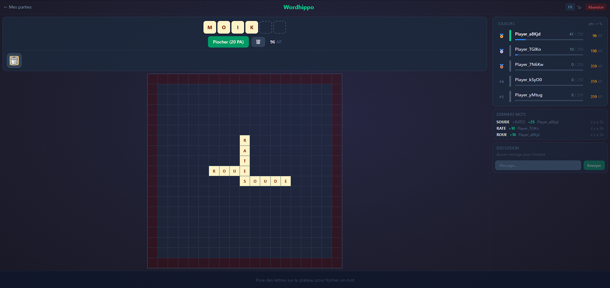

# Corentin COUASNON - Développeur de jeux-vidéo

Bienvenue sur mon portfolio ! Ici, vous trouverez une courte présentation ainsi qu'une sélection de mes projets.

---

## 👋 Introduction

🎮 Je suis **Corentin Couasnon**, développeur spécialisé dans le jeu vidéo, je suis à la recherche d'un poste où je peux continuer à créer des expériences engageantes. J'ai principalement travaillé avec Unity en C#, et c'est dans cet écosystème que je souhaite continuer à progresser et créer.

✨ Ce que j'aime particulièrement, c'est améliorer l'**expérience utilisateur** et intégrer des systèmes de jeu complexes. Participer à toutes les étapes d'un projet, de l'idée à la sortie, est ce qui me motive au quotidien.

👾 En tant que joueur régulier, j'ai une bonne compréhension de ce qui rend un jeu **captivant**, et j'adore travailler en équipe pour créer des jeux qui marquent les esprits.

---

## 🚀 Projets

### 1. Kirae

Kirae est une application mobile ayant pour but de développer et certifier les compétences de ses utilisateurs. L'application regroupe une dizaine de mini-jeux permettant d'entraîner une compétence clé chacun.

  Unity
  C#

[▶ Vidéo de présentation de Kirae](https://www.youtube.com/watch?v=TCc27GlOGVI)

  

    
    

      <h3>Écran des jeux de l'app</h3>
      
Sélection parmi une dizaine de mini-jeux, chacun ciblant une compétence cognitive : mémoire, réactivité, planification...

    

  

  

    
    

      <h3>Jeu "Avec ceci?"</h3>
      
Mémorisez les commandes des clients et servez-les correctement. Entraîne la mémoire de travail à court terme.

    

  

  

    
    

      <h3>Jeu "Sushi Master"</h3>
      
Attrapez les sushis, évitez les arêtes sur le tapis roulant. Entraîne la réactivité et la prise de décision rapide.

    

  

### 2. Soft Kids

Soft Kids est une application mobile éducative destinée aux enfants, déployée sur iOS et Android. L'application propose 8 programmes de développement socio-émotionnel (confiance en soi, intelligence émotionnelle, inclusion, etc.), chacun décliné en modules et mini-jeux interactifs. Les parents disposent d'un espace dédié pour suivre la progression de leurs enfants.

  Unity
  C#
  Firebase

  

    
    

      <h3>Espace parents</h3>
      
Suivi de la progression de l'enfant par programme et par niveau.

    

  

  

    
    

      <h3>Mini-jeu de tri</h3>
      
Parmi les 30+ types de jeux, un système de swipe pour trier des cartes.

    

  

  

    
    

      <h3>Défis quotidiens</h3>
      
Activités de réflexion guidée pour ancrer les apprentissages au quotidien.

    

  

### 3. Gaming Campus

Plus d'une dizaine de jeux réalisés au Gaming Campus, d'une durée moyenne d'une semaine et la plupart en groupe de deux ou trois personnes. Chaque projet était porté sur un aspect du développement de jeux vidéo (multijoueur, IA, génération procédurale, etc.)

  Unity
  C#

  

    
    

      <h3>Scrabbland</h3>
      
Jeu roguelike autour du Scrabble. Développement d'IA au comportement avancé.

      <a class="card-link" href="https://github.com/CorentinCouasnon/Scrabbland" target="_blank">Voir sur GitHub →</a>
    

  

  

    
    

      <h3>FPS Microgame Multijoueur</h3>
      
Ajout d'une fonctionnalité multijoueur à un jeu de démo FPS de Unity.

      <a class="card-link" href="https://github.com/CorentinCouasnon/MicrogameGC" target="_blank">Voir sur GitHub →</a>
    

  

  

    
    

      <h3>Snow Sickness</h3>
      
Jeu multijoueur 2D de combat de boules de neige.

      <a class="card-link" href="https://superzero4.itch.io/snow-sickness" target="_blank">Voir sur Itch.io →</a>
    

  

### 4. Projets personnels

Deux projets développés en dehors du travail, par intérêt personnel.

  

    
    

      <h3>WordHippo</h3>
      

        Firebase
        IA
      

      
Jeu de mots multijoueur en ligne inspiré du Scrabble. Grille 19×19, système de compétences, boutique de power-ups et matchmaking par niveau.

    

  

  

    
    

      <h3>Poker Hand Tracker</h3>
      

        IA
      

      
Outil de suivi de mains de poker en direct. Saisie des actions, calcul automatique du pot et des stacks, avec la possibilité d'interroger une IA en temps réel pour se faire coacher et analyser ses décisions main par main.

    

  

> _Découvrez plus de projets parmi des sites webs, un Tic Tac Toe en Lua, un bot Discord et plus encore sur mon [GitHub](https://github.com/CorentinCouasnon) !_

---

## 📄 CV

<a class="btn-cv" href="./files/CV Corentin Couasnon.pdf" download>Télécharger mon CV</a>

---

## 🌐 Me contacter

- **GitHub :** [CorentinCouasnon](https://github.com/CorentinCouasnon)
- **LinkedIn :** [Corentin Couasnon](https://www.linkedin.com/in/corentin-couasnon/)
- **Email :** ccouasno@gmail.com
- **Téléphone :** 07 50 39 71 43
